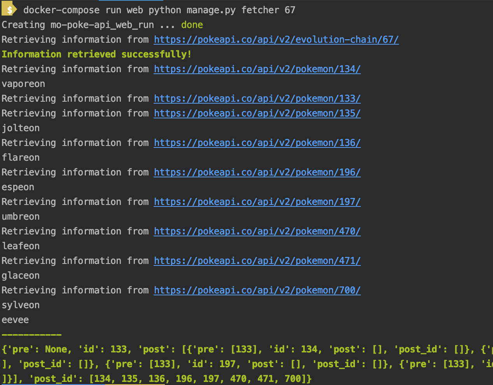
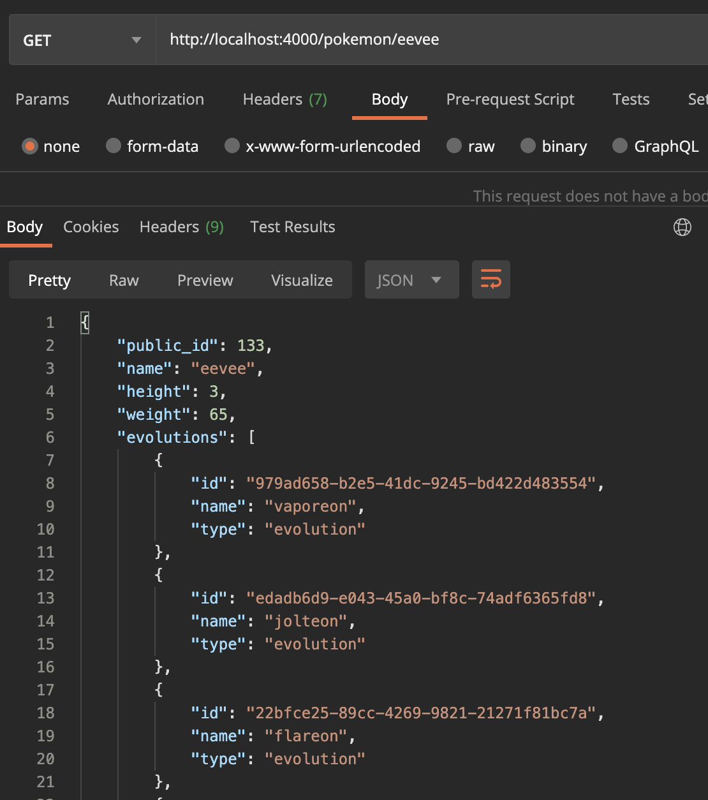

# mo-poke-api

### Run the service
1. docker-compose build
2. docker-compose up

### Migrate data
1. docker-compose run web python manage.py migrate

### Execute fetcher
docker-compose run web python manage.py fetcher {EVOLUTION_ID}

## Hit the endpoint

1. http://localhost:4000/pokemon (for all)
2. http://localhost:4000/pokemon/vaporeon (for a single pokemon)

